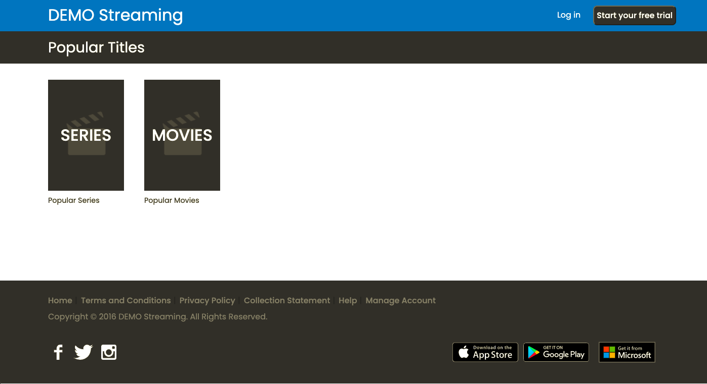
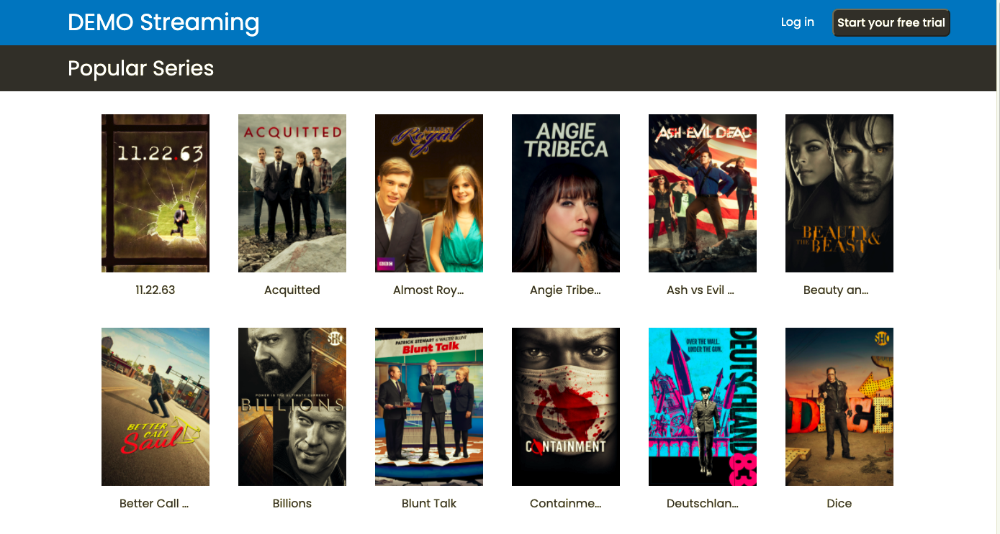

# DEMO Streaming

Desarrollo de una App que muestra la información de series y películas. En la pantalla principal se muestran 2 componentes en los que cada uno renderizan 20 tarjetas con el título y poster de la película o serie, al hacer click sobre el título se despliega un pop up con información adicional.

---

## Comenzando 🚀

Primero se debe clonar el repositorio y ejecutar "npm install" desde la consola para instalar las dependencias.
Luego correr el comando "npm start", se abrirá automáticamente una ventana del navegador con el proyecto.
Si todo salió bien debería ver esta imagen...⬇️

---

### Vista página de series

---

## Tecnologías utilizadas

El proyecto fue realizado con React, Redux, CSS puro y SASS como preprocesador. 

---

## Deploy 

---

## Información adicional del proyecto

Decidí utilizar SASS como preprocesador de CSS porque me permitía ordenar mejor mis archivos de estilo y también utilizar variables y funciones.
Opté por estructurar todo en carpetas para cada componente y página que se creaba, donde cada una contiene su archivo principal, su archivo de estilos y los test si los tuviera.
También creé una carpeta STYLES con dos archivos dentro, uno para resetear todos los estilos que traen por defecto los navegadores (_reset.scss) y otro donde defino algunas variables, funciones y seteos generales (_base.scss).
Para los pop ups utilicé la librería de "sweet alert" como único elemento no creado desde cero.

Si pudiera arrancar el proyecto de nuevo o tuviera mas tiempo reestructuraría algunos componentes, utilizaría algún framework de diseño, lo que también sería una ventaja para la estabilidad del responsive design, y profundizaría la parte de testing !

